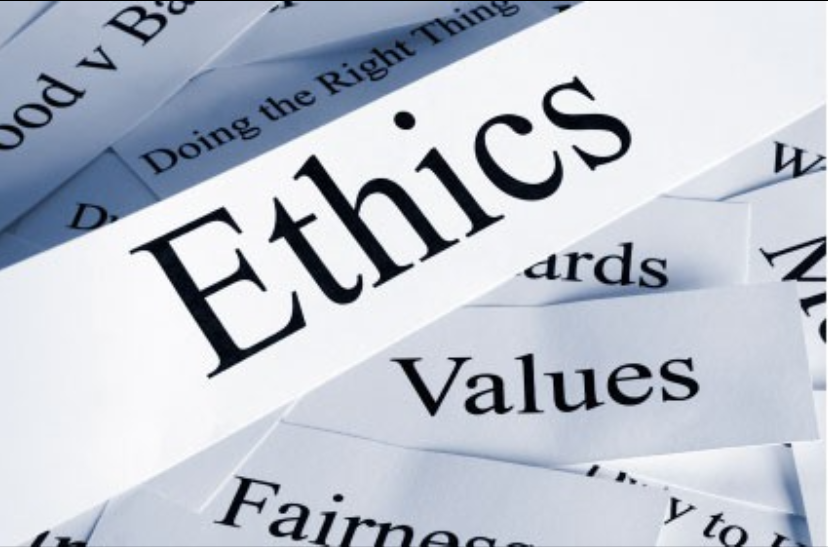

## Software Ethicneers

A few lines of code never hurt anybody... unless it was badly written code. I think the word "ethics" in software engineering means building code for the users. When we write code, the user usually doesn't see what's written. They usually see what runs. User friendliness is what comes to mind when I think of what users want. They want something easy to use and understand. If software engineers wrote code to meet a deadline and deploy what they have, the code may be functional alright, but the outcome can be total trash. The software may have everything it needs but it would be a pain to understand how it runs. Here is where ethics comes in. Merely doing the bare minimum in code doesn't help the user. A few lines of code can go a long way in user friendliness. Providing instructions on how to use a program or just simple labels to explain what something does is a big help for the user.

## Google Needs To Learn About Ethics

Google Street View is great dontcha think? Actually, its really great for gathering personal data. Right after Google Street View launched, many people had their privacy breached. There are now pictures of everything on the streets. Though this may not seem like a problem to most people because they don’t think they are affected, it can be a big problem to those who were affected. Google Street View captured some private pictures that some users requested to remove. This breaks one of the principles of Ethics in [ACM’s Code of Ethics](http://www.acm.org/about-acm/acm-code-of-ethics-and-professional-conduct) by not respecting the privacy of others. They may not have been initially aware of this as they were contributing to society and human well-being, which is one of the principles in the Code.

A few years following the initial release of Google Street View, the Google vehicles which were driven around to take pictures for the street view contained software which collected personal data from unencrypted WiFi networks. Google blamed it on a single engineer but it was later learned that the engineer’s superiors knew about the software. This breaks multiple principles of Ethics in both [ACM’s Code of Ethics](http://www.acm.org/about-acm/acm-code-of-ethics-and-professional-conduct) and [ACM’s Software Engineering Code of Ethics](http://www.acm.org/about/se-code) by not being truthful about their public statements and accessing and collecting private data.

## Ethics is Common Sense

I personally believe ethics is common sense. The Code of Ethics provided by ACM all seem to be common sense, which many seem to lack. I think it is because of the lack of common sense that there are these principles and guidelines for people to follow. Some of the Code is a bit more advanced in which are more thought out and require the person to think more carefully about what they do.

When I hear about ethics, I immediately think about the GLOs (General Learner Outcomes) from elementary school. Based on the [Hawaii Public School's website](http://www.hawaiipublicschools.org/TeachingAndLearning/StudentLearning/LearnerOutcomes/Pages/home.aspx) the GLOs are the "overarching goals of standards-based learning for all students in all grade levels." I asked both of my younger brothers if they remember the GLOs and they both remembered GLO #6, Effective and Ethical User of Technology. The definition of ethics may be a bit different but its still ethics. It teaches kids ethics regarding the use of technology and information such as: privacy, copyright, and citation of sources. I generally feel like any type of Codes of Conduct is also a Code of Ethics because they really should be common sense!
