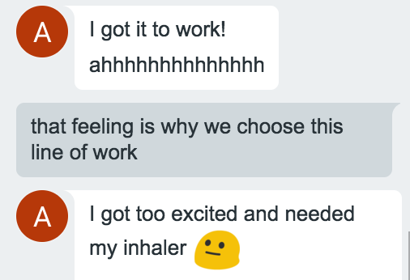

# Do You Have Any Problems?

When you first start off with something new, there are bound to be problems. Most of the time, these problems can be solved with a bit of tinkering around, googling for help, or asking your peers for help. Here are some of the problems I have encountered on my journey to learning meteor.

## Is It Even Working?

The first problem I have encountered when using meteor was the slow startup time. Other classmates had problems like this and found solutions and shared it. The professor then updates a page with meteor tips to help everyone to configure their settings to optimize the meteor app startup time. In my case, I am using Git Bash, a command prompt alternative, and there is no status bar so I don't know if the command I put in is working or not. I waited over 10 minutes before stopping it and wondering what was wrong. I wouldn't know if the computer was doing anything so I got stuck wondering if it was even working. I then remembered one of my classmates had a problem like this and tried his solution. The solution worked very well and the first time took a few minutes and every time after that took less than a minute for meteor to start up. Getting something to work after having problems is a very good feeling.

## Where Are The Imported Goods?

The second meteor problem I have encountered was forgetting to import statements. By importing statements, it links your files together. This has caused me to waste a lot of time looking through all the files of code I had done trying to figure out what was wrong. Even after watching one of the professors screencasts where he tells us that when something isn't showing up, it is because you didn't import the file or route the file. This should be the first thing to check if the page doesn't crash and things aren't showing up. This has escaped my thought many times because the statements at the top come out to be 'import ...' just because the window wants to save space. I have begun looking around for a solution so the file doesn't automatically shorten the code, but I might just have to remember to check that first every time. After forgetting so many times, it should just come to me that I forgot an import statement. I think that I should just make it a habit to check all the files I have worked on and made sure that they have the import statements when they are needed.
