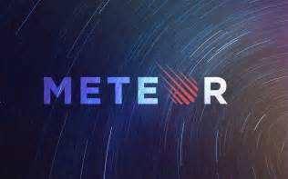

# Ouch My Head Hurts

When I started using Meteor, it hit me in the head and left a dent. With the very first meteor tutorial that we did, I followed all the steps and something happened but I had no clue of how anything worked. I found the new format and use of spacebars to be pretty hard. Learning how to use a "Collection" and learning about "Publishing" and "Subscribing" was definitely something new to me. Something that would also be hard would be building everything from scratch. We had templates to follow so that made everything a lot easier. I found being able to use JavaScript and Semantic UI to build an app to be pretty easy. Going back to using something I was more comfortable with helped me get used to Meteor faster. If everything was completely new I would probably dread learning everything from scratch. Just adding on bits of new information and understanding them made my experience with Meteor a lot better.

My first impression on meteor was, “Coolio, I can make apps with this¿¿¿”. I was surprised with what meteor had to offer. I had no prior experience with any app building platform. Meteor uses a database called “Mongo” that has something called a Minimongo, which is a local version of the database. This makes retrieving data easy and fast. Meteor is also real time by default, which means once you make changes in your code, the app updates instantly!

## Recovering From The Smash

As I completed the detailed assignments, using meteor came to me a bit more naturally. We had an assignment called Digits that was separated into six parts. After finishing each part twice, I did the whole assignment one more time from start to finish. I had to look back at the screencasts the professor provided a few times to jog my memory but that helped me solidify what I learned even more.

## Trailing Thoughts

Now I have more experience with Meteor, the dent on my head is slowly going back to normal. As we head into working on a final project for class, I am more comfortable with using Meteor but there is still a long way to go in order to get a full understanding of everything that happens inside Meteor. I look forward to being able to use Meteor to build apps in the future.
