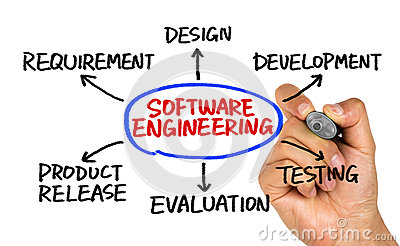

The very first programming class I took was EE160, C programming with Tep during my second semester of being a freshman. I did not get a good grade for his class and decided to retake the class the next semester. The second time taking the class, I understood it much more, got a way better grade, and got me interested in programming. I talked with Gerald and switched to Computer Science during my second half of sophomore year.

When I got to Jason’s ICS 111 class, I was very excited because the way his class was, we got to make programs that made object(s) move! This made me a lot more interested because of all the wonderful things programming could do. Taking my ICS 211 class with professor Moore showed me some very important parts of Java with some data structures, recursion, sorting algorithms, and a bit of software engineering. I believe that all the concepts of software engineering are very important to writing good code.

 

I am interested in learning a lot more programming languages and hope to be able to use them well. I think web development would be something important to learn. I also think that cyber security would be a very cool thing to learn. I was worried about how we would be able to show off what we have done but I believe this Software Engineering class will ready that for us with the techfolios and the technical essays we would have to write. I am glad this class is here to help us with that along with teaching us JavaScript and more. I am looking forward to learning all that I can and preparing myself for all the things to come.
