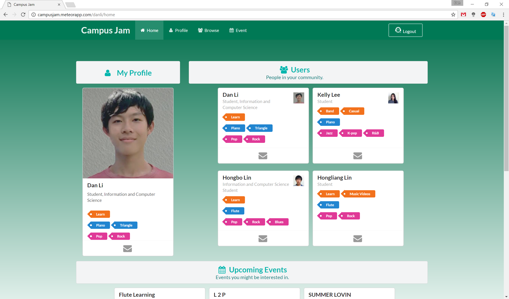

# I Feel Like Jammin'

Campus Jam is an app that provides University of Hawaii community members a way to learn, make friends, and jam it out with fellow community members. Anyone with a UH account (with their accounts added onto the CAS test servers) can login and create a profile. After creating a profile, they can see other users in their community as well as any past and upcoming events on their home page. The user can browse for other members with the same goals, tastes, and capabilities. They could also search for people with certain capabilities that they may want to have a casual jam session with or even create a band. Lastly, there is an event page used to create events.

### It Gets Better
Some future improvements that could be made on this app would include the clean up of the background, ability to edit and delete events, an admin page to manage users and events, and allowing users to follow or add favorite users and events.

## How Was This Made?
The project was made with Javascript using Semantic UI framework, Meteor as the platform and MongoDB as the database. The project consisted of collections which were used to store data. ESLint was used to improve our code quality.

## What Did I Do?
My contributions to the project include managing the overall project, updating the github.io page, and deploying the project on Meteor. I was in charge of the profile page, UH CAS system, goal and capability collections, and managing the database. There was also collaboration between each group member on most of the issues to make sure each issue was resolved quickly. There was collective group effort on the designing of pages and content of pages.

## With Great Struggle Comes Great Knowledge
What I learned from this experience was a mix together of what I learned in Software Engineering. These include Javascript, HTML, CSS, GitHub, Semantic UI, Meteor, Quality Assurance, and Project Management. Many of these concepts were learned early on and it took a bit of relearning in order to be able to put every piece of this puzzle together. Working in a group using GitHub started out as a bit of a challenge since we had to learn how to branch, push, pull, and merge without breaking the project. Learning to follow the [Issue Driven Project Management](http://courses.ics.hawaii.edu/ics314s17/morea/project-management/reading-guidelines-idpm.html) guidelines set by Professor Johnson using GitHub’s features like the milestones and projects proved to be very helpful in keeping us organized and on track of what we had to get done. 

Check out the complete project page on [GitHub](https://campusjam.github.io/).
