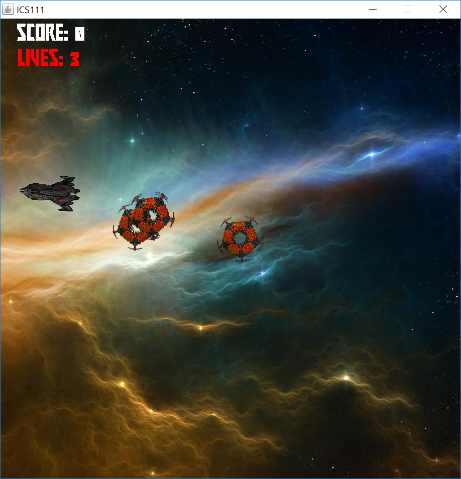
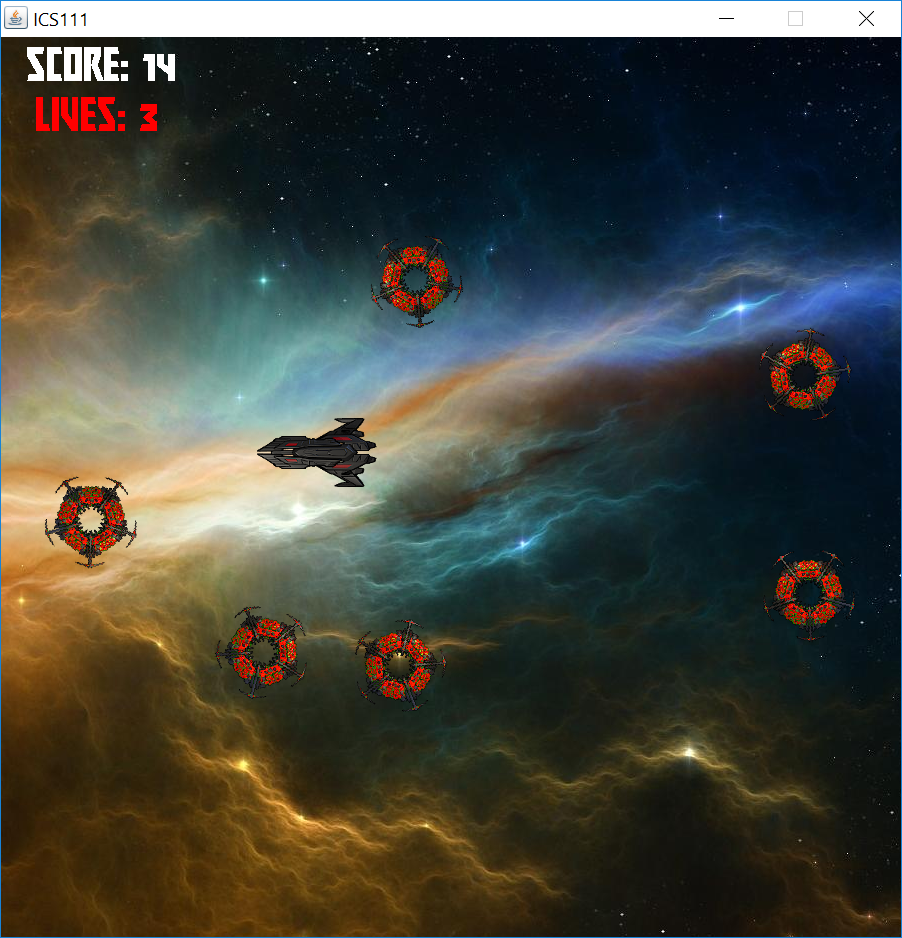
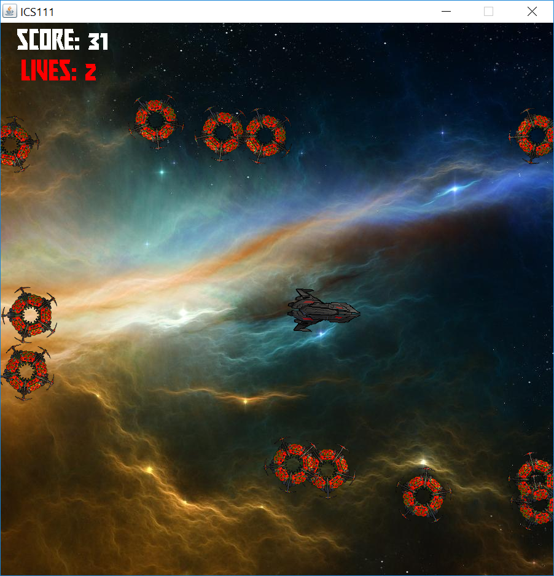
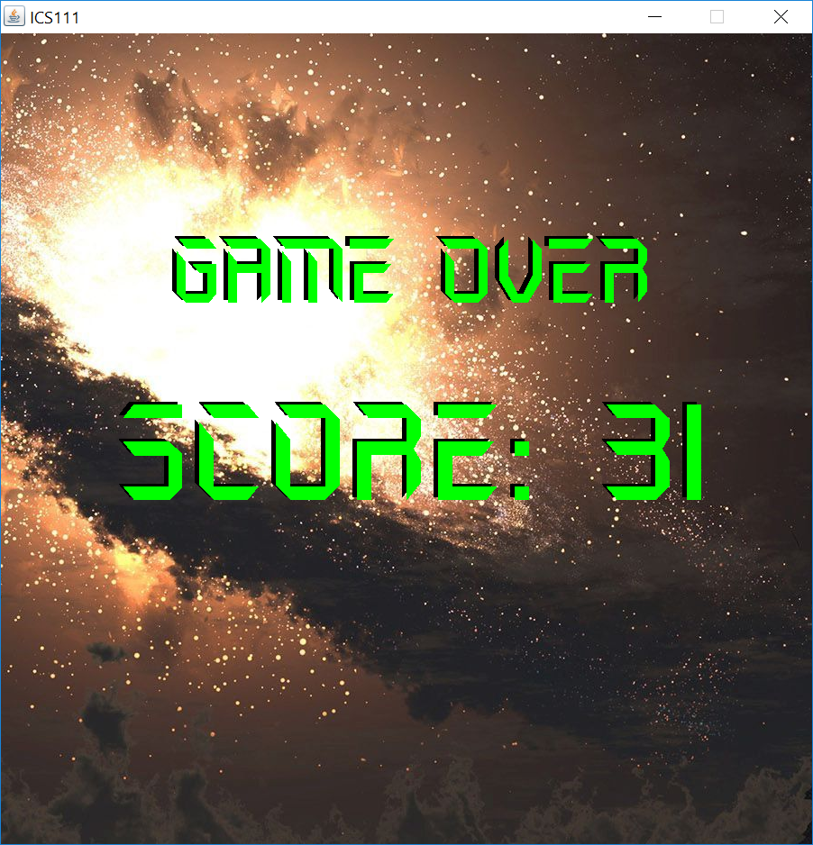

  
For the final project, we had to work in groups of 3 or 4. I did not know anyone in the class so I waited for the other left over people to be placed in groups. I got placed in a group with two others who had already started brainstorming ideas. They filled me in on the ideas and I was all for it. We went through multiple drafts of what we wanted to make. After consulting with our TA multiple times, we ended up with a spaceship shooting game. We had to decide who did what. One person did the main and obstacles, another person did the spaceship, and I did the bullets. It took us about a week of working on it just about everyday to put our finished individual parts together and tweak it to make sure everything worked together. The objective of the game is to survive as long as possible to destroying the obstacles. To move, use the wasd keys and press spacebar to shoot. You have 3 lives so the game ends when you run out of lives and a game over screen is displayed with your score. We learned to communicate effectively so we could be as efficient as possible and help each other out if we got stuck.

Here is the finished project (without music): https://github.com/daaaaanl/ICS111

  
  
  
  

