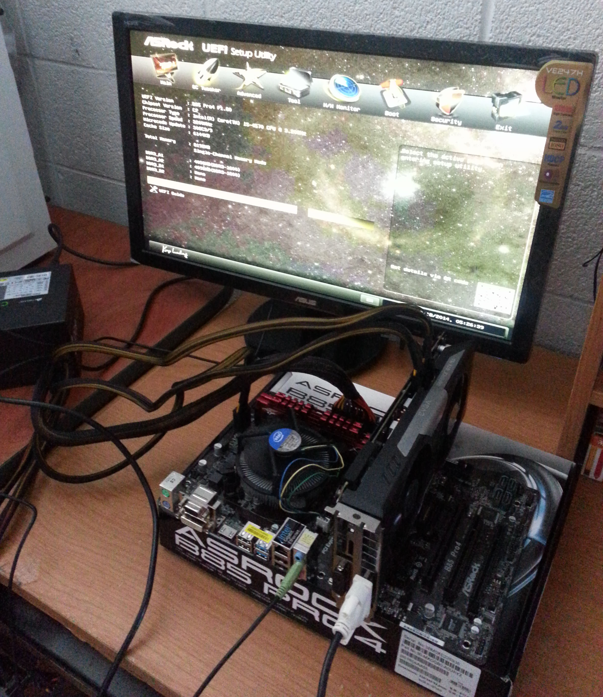

During the winter of 2013-2014, I got a computer desk so I decided to build my own computer. I asked my friend about building a computer and he told me it wasn’t hard, it was cheaper, and a lot nicer than the prebuilt ones out there. I started doing research on what I wanted my computer to have and what I’d need it for. I occasionally play games and wanted to use it for college, as I started college that Fall. With that in mind, I decided to get a graphics card, at least 8 gb RAM, and a SSD. Along with my SSD I bought a 2TB hard drive since this would be my computer I’ll have for many years. 

I did a lot of research over the winter break browsing websites like Reddit, YouTube, Newegg, Amazon, and pcpartpicker.com during work and at home before ordering the parts online. My parts came staggered over the course of three weeks and I waited for everything to come in before starting it on the weekend. I had free shipping for almost everything because I used my trial of Prime on Amazon and my trial of shoprunner on Newegg. The case was the only part I had to pay shipping for, which was over half the cost of the case itself. Every part that came in was like a present and I looked forward to coming home and receiving the parts. When everything came in I had to take an obligatory photo.

  

After unpacking everything, I got to work and messaged my friend along the way for some guidance. During the assembly stage, testing your parts to see if they run is a must. After you put in the processor, CPU fan, RAM sticks, and graphics card (if you have), hook it up to your power supply and monitor to make sure it starts up. If you don’t make sure it runs before you screw the motherboard in case, you’ll be making more work for yourself.

  

After testing to make sure everything worked, the motherboard is placed into the case and screwed in. One of the only things left was to manage all the cables inside. Luckily the case I bought was very good for managing cables. The other side of the case could be unscrewed and the cables could be looped through to that side and the main body of the case would be very free of cables for maximum airflow.

  
  
  

After everything was put into place, I started it up and it’s one of the best feelings you can have when you accomplish a project like this. Following building my computer, I have helped a few people pick parts, given them advice, and walked them through with building their own computers. With all of this, I have learned to do extensive research, budgeting, computer hardware knowledge, and gained computer building experience. On top of that, I had fun building my computer. I would love to build another when the time comes. 

  
  

