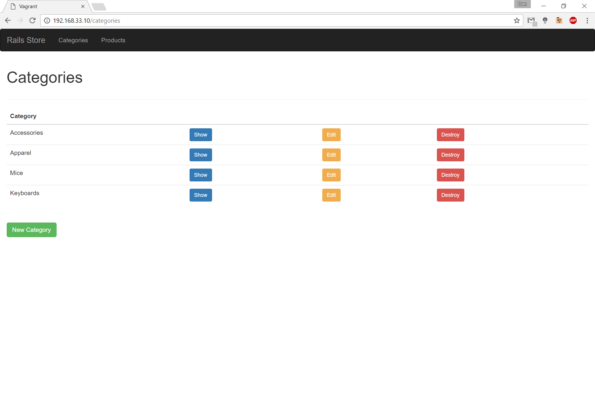
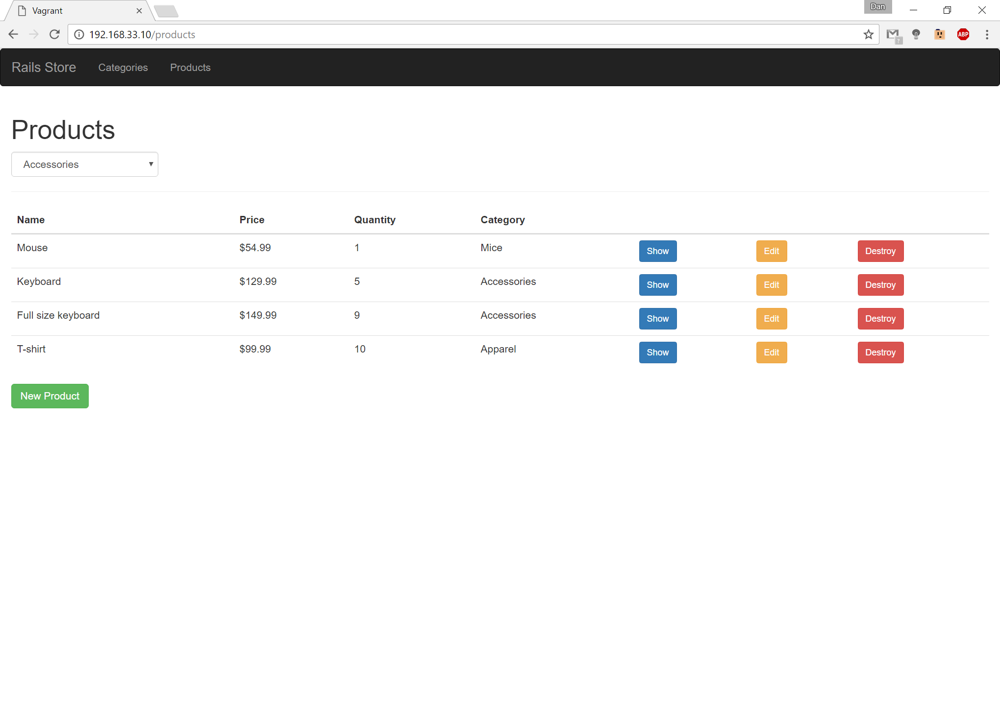
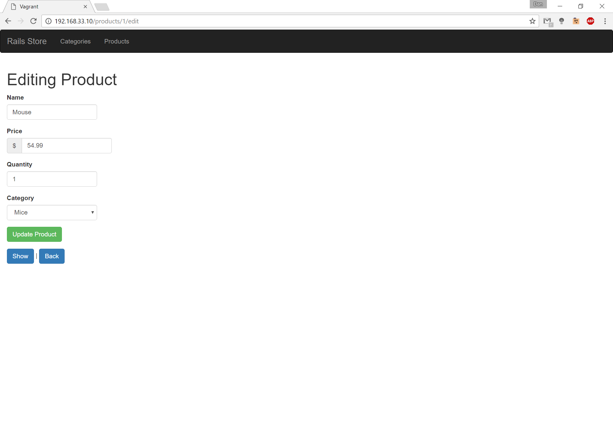

During the Fall 2016 semester of ICS 211, our ATA Tor asked us if there were people interested in learning a bit more in a beginner "class", where we met once a week. There was a handful of people who showed up. He started with the very basics by going over the primitive data types and describing how to use git a bit. A few weeks in, he asked us what we wanted to learn, which ranged from data servers to web dev and styling (like colors and placements on a web page). We came to a concensus of web development since that also happened to be his specialty. So, he gave us some resources on HTML and CSS and had us download virtual box and vagrant, as that was where we did everything. He walked us through the whole process of setting up a web page with ruby on rails to create a simple store that can take in items and quantities. We also used bootstrap and slowly added and cleaned up things like style and format each week we met up and on our own time. He provided us with a bunch of resources and and made himself available for any questions we had by adding us to a group on gitter and github. 

  
  
  

This is what we ended up with at the end of our meetings:
https://github.com/daaaaanl/rails-playground
